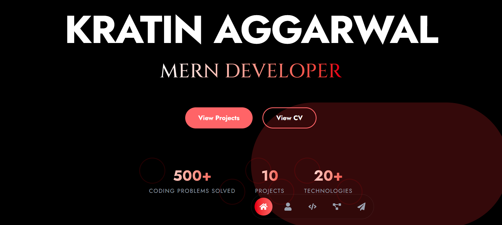

#  👨‍💻 Kratin Aggarwal — Portfolio


<div align="center">
  
[](https://reactjs.org/)
[](https://tailwindcss.com/)
[](https://vitejs.dev/)
[](https://www.netlify.com/)

</div>

<p align="center">A simple and responsive personal portfolio website to share my work, skills, and projects. Built with care using modern web technologies and a touch of smooth animations for a pleasant user experience.</p>


<div align="center">

[Features](#-features) •
[Technologies](#%EF%B8%8F-technologies-used) •
[Installation](#-installation--setup) •
[Structure](#-project-structure) •
[Deployment](#-deployment)

</div>

---

## 📸 Screenshot

<div align="center">
     
</div>

## ✨ Features

<table>
  <tr>
    <td>✅ <b>Modern UI Design</b></td>
    <td>A clean, minimal interface with a soft dark mode theme for a professional look and feel.</td>
  </tr>
  <tr>
    <td>✅ <b>Responsive Layout</b></td>
    <td>Carefully crafted to look great on any screen size — mobile, tablet, or desktop.</td>
  </tr>
  <tr>
    <td>✅ <b>Interactive Elements</b></td>
    <td>
      • Smooth scroll navigation with active highlights<br>
      • Subtle animations and hover effects on project cards<br>
      • Functional contact section with working form<br>
      • Light particle background for added depth
    </td>
  </tr>
  <tr>
    <td>✅ <b>Organized Sections</b></td>
    <td>
      • Engaging hero section with call-to-action<br>
      • Skills list showcasing tools and technologies<br>
      • Projects section with filters and descriptions<br>
      • Contact area with direct links and form for reaching out
    </td>
  </tr>
</table>


## 🛠️ Technologies Used

<div align="center">

| 🧩 Frontend | 🎨 Styling & Animation | 🧪 Development | 🚀 Deployment |
|:----------:|:----------------------:|:-------------:|:-------------:|
| React.js with Hooks | Tailwind CSS | Vite with HMR | Netlify with CI/CD |
| React Icons & Heroicons | Framer Motion | ESLint & PostCSS | Netlify Forms |
| EmailJS (for contact form) | Custom animations | React Hot Toast | |

</div>


## 🚀 Installation & Setup

<details>
<summary><b>Prerequisites</b></summary>
<br>
  
- Node.js (v16+)
- npm or yarn
</details>

<details>
<summary><b>Getting Started</b></summary>
<br>

1. Clone the repository:
   ```bash
   git clone https://github.com/Rida-Lad/portfolio.git
   cd portfolio
   ```

2. Install dependencies:
   ```bash
   npm install
   # or
   yarn install
   ```

3. Run development server:
   ```bash
   npm run dev
   # or
   yarn dev
   ```

4. Open your browser:
   ```
   http://localhost:5173
   ```
</details>

## 📁 Project Structure

```
portfolio/
├── public/
├── src/
│   ├── components/     # Reusable components
│   ├── data/           # Project data files
│   ├── pages/          # Page components
│   ├── App.jsx         # Main application
│   └── main.jsx        # Entry point
├── .eslintrc.js        # ESLint configuration
├── .gitignore          # Git ignore file
├── index.html          # HTML template
├── package.json        # Project dependencies
├── postcss.config.js   # PostCSS configuration
├── tailwind.config.js  # Tailwind configuration
└── vite.config.js      # Vite configuration
```

## 🌐 Deployment

<div align="center">
  
📤 **Deployed with Netlify** 📤

</div>

This portfolio is deployed using **Netlify**, making it easy to maintain and automatically update with every new commit.

### 🚀 Steps to Deploy Your Own:

1. Push your project to a GitHub repository.
2. Head over to [Netlify](https://www.netlify.com/) and connect your GitHub repo.
3. Set up the build settings:
   - **Build command**: `npm run build` (or `yarn build`)
   - **Publish directory**: `dist` (or `build`, depending on your setup)
   - **Environment variables**: Add any if your project uses them
4. (Optional) Enable Netlify Forms in your HTML if you're using a contact form.
5. Click **Deploy** and you're live!

<details>
<summary><b>⚙️ Continuous Deployment</b></summary>
<br>

To make deployment even smoother, enable automatic deployments by:

- Allowing Netlify to deploy preview branches
- Auto-publishing changes when merged to the `main` branch
- Running build checks before deployment

This ensures your portfolio is always up to date with the latest changes.

</details>


